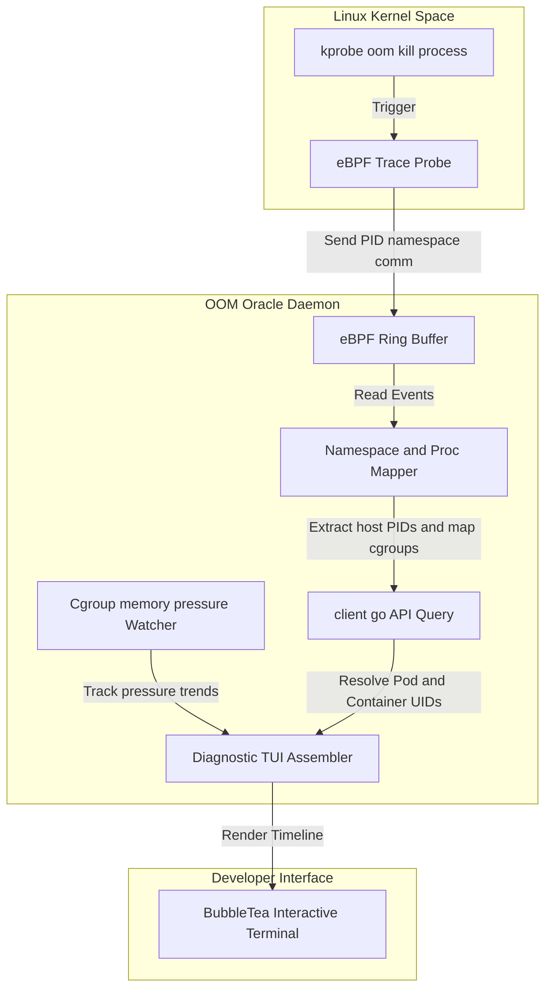

# Kubernetes Pod OOM Oracle 🔮

[](https://opensource.org/licenses/Apache-2.0)
[](https://goreportcard.com/report/github.com/ethan-kane-ops/k8s-pod-oom-oracle)
[](https://ebpf.io)

**Kubernetes Pod OOM Oracle** is an open-source, highly-differentiated low-level system daemon and command-line utility built to predict, detect, and troubleshoot Kubernetes OOM (Out Of Memory) kills. 

Standard Kubernetes control planes only report a generic `OOMKilled` status with exit code 137. They cannot tell you **which** process inside a multi-process container (such as Node.js web clusters, Python worker shards, or JVM garbage collection processes) exceeded the limits, or what the memory climbing curve looked like. 

OOM Oracle hooks directly into host-level Linux kernel events using **eBPF tracing** and **cgroup memory controllers** to isolate the exact process at the millisecond of death, map it back to the Kubernetes container context, and render a timeline-accurate terminal post-mortem.

---

## 🏗️ Architecture



---

## 🌟 Core Features

1. **Active eBPF Kernel Tracer:** Attaches probes to the kernel's `oom_kill_process` event. Extracts precise metadata (PID, host-level PID namespace, executable name `comm`, and memory bytes at death) with near-zero runtime overhead.
2. **Cgroup Pressure Trends:** Continually parses cgroups v1 and v2 directories (`/sys/fs/cgroup/memory` or `memory.pressure`) to track memory saturation trends leading up to the crash event.
3. **Container-to-Pod Mapper:** Reads `/proc/<pid>/cgroup` and `/proc/<pid>/ns/pid` namespaces to correlate raw host-level kernel events back to K8s container scopes and client-go pod definitions.
4. **Timelines-Accurate Terminal Post-Mortem:** Powered by BubbleTea and Lipgloss, it generates high-fidelity, visual diagnostic reports tracing memory growth and identifying the specific victim process inside multi-process runtimes.

---

## 🔬 Two Detectors, One Report

Detection sits behind an interface with two implementations. `--detector` picks
one; the default `auto` tries eBPF and falls back to polling, saying so in the
logs.

| | `ebpf` | `poller` |
|---|---|---|
| Source | kprobe on `oom_kill_process` | `memory.events.local` counters |
| Victim | named by the kernel as it chose | deduced from which process vanished |
| Memory at death | exact, read from the victim's `mm` | from the last snapshot, up to one interval stale |
| Command line | read from `/proc` before `SIGKILL` lands | often unavailable |
| Needs | BTF, `CAP_BPF`/`CAP_SYS_ADMIN`, kernel ≥ 5.8 | readable `cgroupfs`, kernel ≥ 5.13 |

The same workload traced both ways, a container whose forked child is killed
while the container itself survives:

```
ebpf     victim=tail  cmdline=[tail /dev/zero]  rss=511.0MiB  inferred=false
poller   victim=tail  cmdline=<none>            rss=0         inferred=true
```

The poller found the right process by name but had only a snapshot taken before
it grew, so it reports no memory and flags the answer as a guess. Reports carry
`source` and `victim.inferred` precisely so a reader can tell which of these
they are looking at.

The probe reads kernel structs through CO-RE, so one compiled object works
across kernel versions that moved the fields, including the 6.2 rewrite of
`mm_struct.rss_stat`. It attaches to a kprobe rather than the `oom/mark_victim`
tracepoint because that tracepoint's layout is not a stable ABI.

**A known gap in the poller on Kubernetes.** It detects a kill by noticing a
counter rise between two passes, which needs the cgroup to still exist on the
second one. When a container is killed outright the kubelet tears its cgroup
down within milliseconds, and the kill goes unseen. The eBPF detector has no
such dependency: it observes the kill as the kernel makes it. Prefer eBPF on
Kubernetes and treat the poller as the degraded mode it is.

---

## 🧭 From Cgroup Path to Pod Name

A cgroup path proves a pod UID, a container ID, and a QoS class. It cannot prove
a name. Turning `pode257c815_3e31_...` into `oom-oracle-e2e/e2e-multi-process/app`
takes the API server, which is what the pod informer is for.

| | Without the informer | With it |
|---|---|---|
| Identity | pod UID, container ID, QoS | plus namespace, pod, container, image |
| Needs | nothing | `pods: get,list,watch` and a node name |

It is deliberately narrow:

- **Scoped to one node** by the field selector `spec.nodeName=$NODE_NAME`, taken
  from the downward API. A DaemonSet has no business watching every pod in the
  cluster, and there is no cluster-wide fallback: a daemon that could not learn
  its node name refuses to start the informer rather than quietly watching
  everything.
- **Keyed by pod UID**, because that is the only key a cgroup path offers.
- **Container IDs include the previous one.** After an OOM kill the container
  restarts with a new ID while the cgroup path recorded against the kill still
  names the dead one, so `lastState.terminated.containerID` is indexed too.
  Without it a restarted container resolves to a pod but not to a container.
- **Deleted pods stay resolvable for five minutes.** A container killed outright
  takes its pod with it, and under a controller the replacement arrives within
  seconds. Dropping the entry on the delete event would lose the identity at
  exactly the moment the tool exists to explain.
- **Pods are trimmed before caching**, dropping managed fields and the
  last-applied annotation, which are routinely larger than the rest of the
  object. The daemon ships with a 128Mi limit and an OOM diagnostic that OOMs on
  its own cache would be a poor advertisement.

`--kubernetes` controls it: `auto` (default) degrades to UID-only correlation
and logs why, `on` refuses to start without the API server, `off` never contacts
it. Readiness is deliberately **not** gated on the cache: `/readyz` means the
probe is attached and history is being kept, and coupling that to control plane
availability would get a perfectly good daemon restarted. `/v1/status` reports
`node`, `podCacheSynced` and `podsTracked` instead.

The cost is client-go. It takes the stripped `linux/amd64` binary from 10.8MB to
48.4MB, which is ordinary for Kubernetes tooling but not nothing.

---

## 💻 Visual Terminal Post-Mortem

Inspect incident diagnostics with a single command:

```
$ oom-oracle inspect pod/payment-api-6d5f78 -n default
POD: payment-api-6d5f78 (namespace: default)
CONTAINER: web-server (image: payment:v1.2.0)

DIAGNOSIS: OOMKilled (2026-05-21 08:15:22 UTC)

MEMORY TRAJECTORY (Last 60s):
  08:14:22: 412MB/512MB [██████████████░░░░] 80%
  08:14:52: 498MB/512MB [██████████████████░] 97%  (High Pressure Event)
  08:15:22: 512MB/512MB [███████████████████] 100% (OOM Triggered)

VICTIM PROCESS DETAILS:
  PID: 28145  
  Command: node ./dist/garbage-collector.js
  Exit Code: 137 (OOM)
  Memory at death: 114MB

HOG PROCESSES IN CONTAINER:
  1. node ./dist/server.js (PID 28102) - 390MB (Active)
  2. node ./dist/garbage-collector.js (PID 28145) - 114MB (Killed)
```

---

## 🚀 Quickstart

Because OOM Oracle relies on eBPF to attach to host kernel events, the daemon must run as a privileged DaemonSet (`CAP_SYS_ADMIN` or `privileged: true`):

1. **Add the Helm Repo:**
   ```bash
   helm repo add ethan-kane-ops oci://ghcr.io/ethan-kane-ops/charts
   ```
2. **Install the DaemonSet:**
   ```bash
   helm upgrade --install oom-oracle ethan-kane-ops/k8s-pod-oom-oracle \
     --namespace oom-oracle \
     --create-namespace \
     --set securityContext.privileged=true
   ```
3. **Inspect Local Events:**
   ```bash
   oom-oracle daemon --watch
   ```

---

## 🛠️ Local Development

### Prerequisites

* Go 1.26+ (pinned in `.mise.toml`)
* Linux Kernel $\ge$ 5.8 (with BTF enabled for eBPF tracing)
* [mise](https://mise.jdx.dev/) (Runtime manager)
* [just](https://just.systems/) (Task executor)

### Get Started

1. Install dependencies and CLI tools:
   ```bash
   mise install
   ```
2. Compile the binary locally:
   ```bash
   just build
   ```
3. Run linter and tests:
   ```bash
   just check # executes vet, linter checks, and unit tests
   ```

The compiled eBPF objects in `internal/detector/bpf` are committed, so none of
the above needs clang. After editing the BPF C, regenerate them:

```bash
just bpf-generate  # compiles in a pinned container
just bpf-verify    # fails if the committed objects are stale (also runs in CI)
```

This runs in Docker because Apple's clang has no BPF backend. Developing on a
Mac otherwise works normally: the detector is unavailable there, the rest of
the tool is not.

### End-to-end tests

The unit suite proves the parsers. The e2e suite proves the product: it deploys
the daemon to a kind cluster, makes real pods exceed real limits, and asserts on
the post-mortems the deployed daemon produced.

```bash
just e2e       # create the cluster, deploy, run the suite
just e2e-logs  # the deployed daemon's logs, when a run fails
just e2e-down  # tear the cluster down
```

Every bug that has mattered in this project was found this way rather than by a
unit test, including two in this suite's first run: the agent silently losing
all capabilities because the distroless base runs as non-root, and every pod on
a kubelet with its own cgroup root being classified as `Unknown` QoS.

---

## 📄 License

Distributed under the Apache License 2.0. See `LICENSE` for details.

`internal/detector/bpf/oomtracer.bpf.c` is the one exception: it is GPL-2.0, as
marked by its SPDX header. It calls GPL-only BPF helpers, and the kernel refuses
to load a program that declares any other licence. It is compiled to a BPF
object and loaded into the kernel, not linked into the Go binary.
