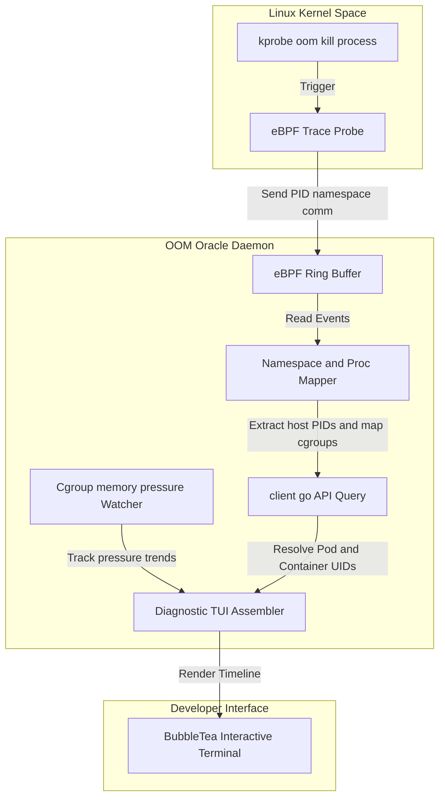

# Kubernetes Pod OOM Oracle 🔮

[](https://opensource.org/licenses/Apache-2.0)
[](https://goreportcard.com/report/github.com/ethan-kane-ops/k8s-pod-oom-oracle)
[](https://ebpf.io)

**Kubernetes Pod OOM Oracle** is an open-source, highly-differentiated low-level system daemon and command-line utility built to predict, detect, and troubleshoot Kubernetes OOM (Out Of Memory) kills. 

Standard Kubernetes control planes only report a generic `OOMKilled` status with exit code 137. They cannot tell you **which** process inside a multi-process container (such as Node.js web clusters, Python worker shards, or JVM garbage collection processes) exceeded the limits, or what the memory climbing curve looked like. 

OOM Oracle hooks directly into host-level Linux kernel events using **eBPF tracing** and **cgroup memory controllers** to isolate the exact process at the millisecond of death, map it back to the Kubernetes container context, and render a timeline-accurate terminal post-mortem.

---

## 🏗️ Architecture



---

## 🌟 Core Features

1. **Active eBPF Kernel Tracer:** Attaches probes to the kernel's `oom_kill_process` event. Extracts precise metadata (PID, host-level PID namespace, executable name `comm`, and memory bytes at death) with near-zero runtime overhead.
2. **Cgroup Pressure Trends:** Continually parses cgroups v1 and v2 directories (`/sys/fs/cgroup/memory` or `memory.pressure`) to track memory saturation trends leading up to the crash event.
3. **Container-to-Pod Mapper:** Reads `/proc/<pid>/cgroup` and `/proc/<pid>/ns/pid` namespaces to correlate raw host-level kernel events back to K8s container scopes and client-go pod definitions.
4. **Timelines-Accurate Terminal Post-Mortem:** Powered by BubbleTea and Lipgloss, it generates high-fidelity, visual diagnostic reports tracing memory growth and identifying the specific victim process inside multi-process runtimes.

---

## 💻 Visual Terminal Post-Mortem

Inspect incident diagnostics with a single command:

```
$ oom-oracle inspect pod/payment-api-6d5f78 -n default
POD: payment-api-6d5f78 (namespace: default)
CONTAINER: web-server (image: payment:v1.2.0)

DIAGNOSIS: OOMKilled (2026-05-21 08:15:22 UTC)

MEMORY TRAJECTORY (Last 60s):
  08:14:22: 412MB/512MB [██████████████░░░░] 80%
  08:14:52: 498MB/512MB [██████████████████░] 97%  (High Pressure Event)
  08:15:22: 512MB/512MB [███████████████████] 100% (OOM Triggered)

VICTIM PROCESS DETAILS:
  PID: 28145  
  Command: node ./dist/garbage-collector.js
  Exit Code: 137 (OOM)
  Memory at death: 114MB

HOG PROCESSES IN CONTAINER:
  1. node ./dist/server.js (PID 28102) - 390MB (Active)
  2. node ./dist/garbage-collector.js (PID 28145) - 114MB (Killed)
```

---

## 🚀 Quickstart

Because OOM Oracle relies on eBPF to attach to host kernel events, the daemon must run as a privileged DaemonSet (`CAP_SYS_ADMIN` or `privileged: true`):

1. **Add the Helm Repo:**
   ```bash
   helm repo add ethan-kane-ops oci://ghcr.io/ethan-kane-ops/charts
   ```
2. **Install the DaemonSet:**
   ```bash
   helm upgrade --install oom-oracle ethan-kane-ops/k8s-pod-oom-oracle \
     --namespace oom-oracle \
     --create-namespace \
     --set securityContext.privileged=true
   ```
3. **Inspect Local Events:**
   ```bash
   oom-oracle daemon --watch
   ```

---

## 🛠️ Local Development

### Prerequisites

* Go 1.22+
* Linux Kernel $\ge$ 5.8 (with BTF enabled for eBPF tracing)
* [mise](https://mise.jdx.dev/) (Runtime manager)
* [just](https://just.systems/) (Task executor)

### Get Started

1. Install dependencies and CLI tools:
   ```bash
   mise install
   ```
2. Compile the binary locally:
   ```bash
   just build
   ```
3. Run linter and tests:
   ```bash
   just check # executes vet, linter checks, and unit tests
   ```

---

## 📄 License

Distributed under the Apache License 2.0. See `LICENSE` for details.
