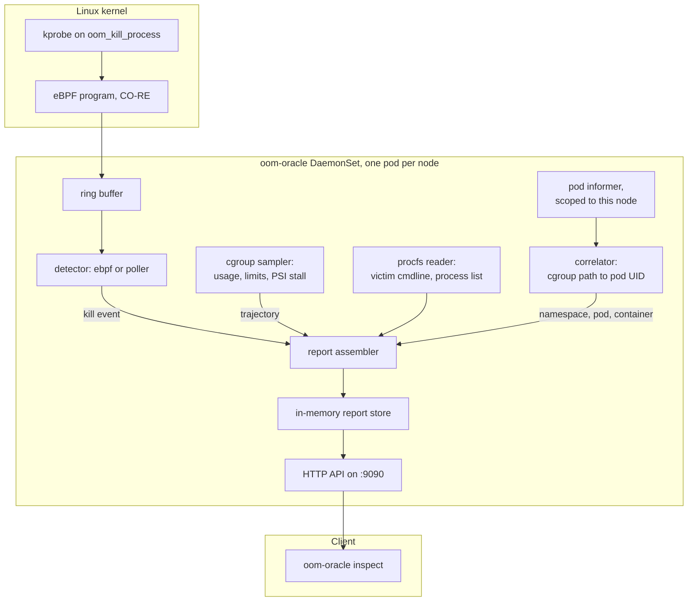

# Kubernetes Pod OOM Oracle 🔮

[](https://github.com/ethan-kane-ops/k8s-pod-oom-oracle/actions/workflows/ci.yml)
[](https://opensource.org/licenses/Apache-2.0)
[](https://goreportcard.com/report/github.com/ethan-kane-ops/k8s-pod-oom-oracle)
[](https://ebpf.io)

A node agent that explains Kubernetes OOM kills at the level the control plane
cannot: which process died, how much memory it held at the moment the kernel
chose it, what the memory curve looked like on the way there, and what was still
running afterwards.

Kubernetes tells you `OOMKilled` and exit code 137, and then stops. It cannot
tell you which of the five processes in that container took the memory, what it
held at the moment the kernel picked it, or whether usage climbed for an hour or
spiked in a second. On a pool of workers that all exec the same binary, "which
one" is the entire question, and the answer is on the node, in a kernel ring
buffer you probably cannot reach.

There is a harder case that depends on your runtime. `memory.oom.group` decides
whether the kernel kills one process or the whole container. containerd sets it
to 1, so the container dies and at least something is reported. Docker and Moby
leave it at 0, and there a forked child can be killed while the container keeps
running: the pod stays `Running`, the restart count stays at zero, and
Kubernetes reports nothing whatsoever.
[`examples/workloads/multi-process-survivor.yaml`](examples/workloads/multi-process-survivor.yaml)
demonstrates both and shows how to tell which you are on.

OOM Oracle attaches a kprobe to the kernel's `oom_kill_process`, samples cgroup
memory continuously so a trajectory already exists when the kill lands, and
resolves the cgroup path back to a namespace, pod and container name.

---

## 🏗️ Architecture



---

## 🌟 What it does

1. **Traces the kill in the kernel.** A kprobe on `oom_kill_process` reports the
   victim's PID, its PID namespace, its `comm`, and its resident memory read out
   of the victim's own `mm` as the kernel selects it. Near-zero overhead, and no
   dependence on the cgroup still existing afterwards.
2. **Keeps a trajectory, not a snapshot.** Cgroup v1 and v2 memory usage, limits
   and PSI stall are sampled continuously into a ring buffer per container, so a
   slow leak arrives with its climb already recorded. An allocation faster than
   the sample interval will not show a climb, and `peakBytes` is read from the
   kernel's `memory.peak` precisely so that case still has an honest number.
3. **Names the process, not just the container.** The victim's `comm` and its
   container-local `nsPid` come from the kernel. `/proc` is also read while the
   victim is dying to recover its full command line and its siblings, though
   that race is often lost and those fields can be absent.
4. **Resolves cluster identity.** A node-scoped pod informer turns the pod UID
   in a cgroup path into a namespace, pod, container and image.
5. **Renders a terminal post-mortem.** Plain text or JSON, over an HTTP API the
   `inspect` command reads.

---

## 🔬 Two Detectors, One Report

Detection sits behind an interface with two implementations. `--detector` picks
one; the default `auto` tries eBPF and falls back to polling, saying so in the
logs.

| | `ebpf` | `poller` |
|---|---|---|
| Source | kprobe on `oom_kill_process` | `memory.events.local` counters |
| Victim | named by the kernel as it chose | deduced from which process vanished |
| Memory at death | exact, read from the victim's `mm` | from the last snapshot, up to one interval stale |
| Command line | read from `/proc` before `SIGKILL` lands | often unavailable |
| Needs | BTF, `CAP_BPF`/`CAP_SYS_ADMIN`, kernel ≥ 5.8 | readable `cgroupfs`, kernel ≥ 5.13 |

The same workload traced both ways, a container whose forked child is killed
while the container itself survives:

```
ebpf     victim=tail  cmdline=[tail /dev/zero]  rss=511.0MiB  inferred=false
poller   victim=tail  cmdline=<none>            rss=0         inferred=true
```

The poller found the right process by name but had only a snapshot taken before
it grew, so it reports no memory and flags the answer as a guess. Reports carry
`source` and `victim.inferred` precisely so a reader can tell which of these
they are looking at.

The probe reads kernel structs through CO-RE, so one compiled object works
across kernel versions that moved the fields, including the 6.2 rewrite of
`mm_struct.rss_stat`. It attaches to a kprobe rather than the `oom/mark_victim`
tracepoint because that tracepoint's layout is not a stable ABI.

**A known gap in the poller on Kubernetes.** It detects a kill by noticing a
counter rise between two passes, which needs the cgroup to still exist on the
second one. When a container is killed outright the kubelet tears its cgroup
down within milliseconds, and the kill goes unseen. The eBPF detector has no
such dependency: it observes the kill as the kernel makes it. Prefer eBPF on
Kubernetes and treat the poller as the degraded mode it is.

---

## 🧭 From Cgroup Path to Pod Name

A cgroup path proves a pod UID, a container ID, and a QoS class. It cannot prove
a name. Turning `pode257c815_3e31_...` into `oom-oracle-e2e/e2e-multi-process/app`
takes the API server, which is what the pod informer is for.

| | Without the informer | With it |
|---|---|---|
| Identity | pod UID, container ID, QoS | plus namespace, pod, container, image |
| Needs | nothing | `pods: get,list,watch` and a node name |

It is deliberately narrow:

- **Scoped to one node** by the field selector `spec.nodeName=$NODE_NAME`, taken
  from the downward API. A DaemonSet has no business watching every pod in the
  cluster, and there is no cluster-wide fallback: a daemon that could not learn
  its node name refuses to start the informer rather than quietly watching
  everything.
- **Keyed by pod UID**, because that is the only key a cgroup path offers.
- **Container IDs include the previous one.** After an OOM kill the container
  restarts with a new ID while the cgroup path recorded against the kill still
  names the dead one, so `lastState.terminated.containerID` is indexed too.
  Without it a restarted container resolves to a pod but not to a container.
- **Deleted pods stay resolvable for five minutes.** A container killed outright
  takes its pod with it, and under a controller the replacement arrives within
  seconds. Dropping the entry on the delete event would lose the identity at
  exactly the moment the tool exists to explain.
- **Pods are trimmed before caching**, dropping managed fields and the
  last-applied annotation, which are routinely larger than the rest of the
  object. The daemon ships with a 128Mi limit and an OOM diagnostic that OOMs on
  its own cache would be a poor advertisement.

`--kubernetes` controls it: `auto` (default) degrades to UID-only correlation
and logs why, `on` refuses to start without the API server, `off` never contacts
it. Readiness is deliberately **not** gated on the cache: `/readyz` means the
probe is attached and history is being kept, and coupling that to control plane
availability would get a perfectly good daemon restarted. `/v1/status` reports
`node`, `podCacheSynced` and `podsTracked` instead.

The cost is client-go. It takes the stripped `linux/amd64` binary from 10.8MB to
48.4MB, which is ordinary for Kubernetes tooling but not nothing.

---

## 💻 The Post-Mortem

`oom-oracle inspect` renders what the daemon recorded:

```
POD: payment-api-6d5f78 (namespace: default)
CONTAINER: web-server (image: payment:v1.2.0)
QOS: Burstable

DIAGNOSIS: OOMKilled (2026-08-13 08:15:22 UTC)
  Limit:        512.0MiB
  Peak usage:   512.0MiB
  Kill count:   1
  Detected by:  ebpf
  Growth rate:  1.0MiB/s (fit R²=0.97 over 1m0s)

MEMORY TRAJECTORY (last 1m0s):
  08:14:22:  412.0MiB / 512.0MiB  [██████████████░░░░]  80%
  08:14:37:  460.0MiB / 512.0MiB  [████████████████░░]  90%  (stall 12%)
  08:14:52:  498.0MiB / 512.0MiB  [█████████████████░]  97%  (stall 24%)
  08:15:07:  507.0MiB / 512.0MiB  [█████████████████░]  99%  (stall 36%)
  08:15:22:  512.0MiB / 512.0MiB  [██████████████████] 100%  (stall 48%)

VICTIM PROCESS:
  PID:             28145 (in container: 17)
  Command:         node ./dist/garbage-collector.js
  Exit code:       137 (OOM)
  Memory at death: 114.0MiB
  Confidence:      traced in the kernel at the moment of the kill.

PROCESSES IN CONTAINER AFTER THE KILL:
  1. node ./dist/server.js (PID 28102) - 390.0MiB
  2. node ./dist/worker.js (PID 28160) - 8.0MiB
```

`stall` is the cgroup's `memory.pressure` **full** ten-second average at that
sample: the share of time during which every task in the cgroup was stalled
waiting on memory reclaim. It climbing ahead of the limit is the signal that a
kill is coming.

`-o json` emits the same report as a machine-readable object.

---

## 🚀 Quickstart

> **Status.** No container image or Helm chart has been published yet. Until the
> release pipeline lands, the supported path is to build the image and load it
> into your cluster. See [Project status](#-project-status).

The daemon needs the host's `/sys/fs/cgroup` and `/proc` mounted read-only,
`hostPID`, and enough privilege to load a BPF program. `deploy/` contains a
DaemonSet configured that way.

### On kind, end to end

```bash
just e2e-deploy   # create the cluster, build the image, load it, roll out the DaemonSet
```

### On any cluster

```bash
# 1. Build and push the image to a registry your nodes can reach
docker build -t <your-registry>/oom-oracle:dev .
docker push <your-registry>/oom-oracle:dev

# 2. Point the DaemonSet at it and apply
kubectl apply -f deploy/
kubectl -n oom-oracle set image daemonset/oom-oracle oom-oracle=<your-registry>/oom-oracle:dev
kubectl -n oom-oracle rollout status daemonset/oom-oracle
```

### Read the reports

The Service is headless on purpose: each agent holds only its own node's
reports, so a load-balanced VIP would answer a question about one node's pod
from a different node's daemon. Query a specific agent.

```bash
kubectl -n oom-oracle port-forward pod/<agent-pod> 9090:9090
oom-oracle inspect                      # every recorded kill, newest first
oom-oracle inspect payment-api-6d5f78   # one pod
oom-oracle inspect -n default -o json   # filtered, machine-readable
```

Confirm the agent is actually watching:

```bash
curl -s localhost:9090/v1/status | jq
```

```json
{
  "detector": "ebpf",
  "cgroupVersion": "v2",
  "ready": true,
  "reports": 3,
  "skipped": 128,
  "unattributed": 0,
  "trackedCgroups": 47,
  "node": "worker-1",
  "podCacheSynced": true,
  "podsTracked": 10
}
```

`detector: "poller"` means the eBPF probe did not attach. The daemon logs the
reason at startup.

`skipped` counts kills that belonged to no Kubernetes container. It climbs on
any busy node, because the probes see every kill on the machine, so it is not a
fault. `unattributed` is the subset that came from inside the kubepods tree,
meaning a real Kubernetes OOM kill the daemon could not place and therefore
never reported. That one should stay at zero, and it is the field to alert on.

---

## 🎛️ CLI

### `oom-oracle daemon`

Watches this node and serves the results. Intended to run as a DaemonSet.

| Flag | Default | Purpose |
|---|---|---|
| `--detector` | `auto` | `auto`, `ebpf`, or `poller`. `auto` falls back; `ebpf` fails loudly instead |
| `--cgroup-root` | `/sys/fs/cgroup` | Path to the cgroup hierarchy |
| `--proc-root` | `/proc` | Path to the proc filesystem |
| `--cgroup-prefix` | `/` | Limit watching to one cgroup subtree |
| `--listen` | `:9090` | HTTP API address |
| `--sample-interval` | `1s` | How often memory is sampled |
| `--poll-interval` | `500ms` | How often the poller checks for kills |
| `--history` | `60` | Memory samples retained per container |
| `--retain` | `256` | Reports retained in memory |
| `--include-non-kubernetes` | `false` | Also report kills outside the `kubepods` tree |
| `--kubernetes` | `auto` | Pod-name resolution: `auto`, `on`, `off` |
| `--node-name` | `$NODE_NAME` | Node whose pods to watch |
| `--kubeconfig` | in-cluster | Credentials to use instead of the in-cluster ones |
| `--log-level` | `info` | `debug`, `info`, `warn`, `error` |
| `--log-format` | `text` | `text` or `json` |

### `oom-oracle inspect [pod]`

Renders post-mortems from a running daemon. With no argument, every recorded
kill is listed newest first. The pod argument accepts a bare name or `pod/<name>`.

| Flag | Default | Purpose |
|---|---|---|
| `--daemon` | `http://127.0.0.1:9090` | Base URL of the daemon to query |
| `-n`, `--namespace` | | Filter by namespace |
| `-c`, `--container` | | Filter by container name |
| `--limit` | all | Maximum reports to render, newest first |
| `-o`, `--output` | `text` | `text` or `json` |

### `oom-oracle version`

Build metadata, as `text` or `json`.

---

## 🔌 HTTP API

| Route | Returns |
|---|---|
| `GET /healthz` | `ok` once the process is up |
| `GET /readyz` | `ready` once the detector is attached and history is being kept |
| `GET /v1/status` | Operational snapshot: detector, cgroup version, counters, pod cache state |
| `GET /v1/events` | All reports, newest first. Filters: `namespace`, `pod`, `container`, `limit` |
| `GET /v1/events/{id}` | One report, or 404 |

---

## 🔐 What it needs, and why

| Grant | Why |
|---|---|
| `privileged: true` | Loading a BPF program and attaching a kprobe. Without it the daemon still runs, on the poller |
| `runAsUser: 0` | A non-root process starts with an empty effective capability set regardless of its bounding set, so `bpf()` returns `EPERM` and the daemon silently degrades |
| `hostPID: true` | `/proc` must show the node's processes, or there is no victim to identify and no process list to build |
| `/sys/fs/cgroup`, `/proc` | Read-only host mounts. The daemon never writes to the node |
| `pods: get,list,watch` | The only cluster access it has. Read-only, and only to turn a pod UID into a name |

The daemon never writes to the node or to the API server.

---

## 🛠️ Local Development

### Prerequisites

* Go 1.26.5 (pinned in `.mise.toml`)
* [mise](https://mise.jdx.dev/) for runtimes, [just](https://just.systems/) for tasks
* Docker, for the e2e suite and for regenerating the eBPF objects
* A Linux kernel ≥ 5.8 with BTF, to run the eBPF detector. macOS builds and
  tests everything except the probe itself

### Get started

```bash
mise install
just build      # → bin/oom-oracle
just check      # tidy + lint (both target platforms) + race tests
```

`just` with no arguments lists every target.

The compiled eBPF objects in `internal/detector/bpf` are committed, so none of
the above needs clang. After editing the BPF C, regenerate them:

```bash
just bpf-generate  # compiles in a pinned container
just bpf-verify    # fails if the committed objects are stale (also runs in CI)
```

This runs in Docker because Apple's clang has no BPF backend. Developing on a
Mac otherwise works normally: the detector is unavailable there, the rest of the
tool is not.

`just lint` runs four passes, `go vet` and `golangci-lint` against both
`GOOS=linux` and `GOOS=darwin`. The eBPF detector and its non-Linux fallback sit
behind mutually exclusive build tags, so a single-platform run always leaves one
of them uncompiled and therefore unchecked.

### End-to-end tests

The unit suite proves the parsers. The e2e suite proves the product: it deploys
the daemon to a kind cluster, makes real pods exceed real limits, and asserts on
the post-mortems the deployed daemon produced.

```bash
just e2e       # create the cluster, deploy, run the suite
just e2e-logs  # the deployed daemon's logs, when a run fails
just e2e-down  # tear the cluster down
```

Every bug that has mattered in this project was found this way rather than by a
unit test, including two in this suite's first run: the agent silently losing
all capabilities because the distroless base runs as non-root, and every pod on
a kubelet with its own cgroup root being classified as `Unknown` QoS.

---

## 📌 Project status

Working today: both detectors, cgroup v1 and v2 sampling, pod-name correlation,
the HTTP API, the text and JSON renderers, and an e2e suite that runs on kind in
CI.

Not built yet: an interactive TUI dashboard, a Helm chart and Artifact Hub
listing, published multi-arch signed releases, and a documentation site. No
version has been tagged, so the HTTP API and report JSON may still change shape.

[ROADMAP.md](./ROADMAP.md) has the full picture, including the known limitations
worth reading before you deploy this on anything you care about.

---

## 🤝 Contributing

Issues and pull requests are welcome.

| | |
|---|---|
| [CONTRIBUTING.md](./CONTRIBUTING.md) | Development setup, task runner, and what a PR should contain |
| [ROADMAP.md](./ROADMAP.md) | Direction, and the limitations this tool currently has |
| [SUPPORT.md](./SUPPORT.md) | Where to ask, and what to include so it can be answered once |
| [SECURITY.md](./SECURITY.md) | Private disclosure, and what this daemon's privileges mean on a node |
| [CODE_OF_CONDUCT.md](./CODE_OF_CONDUCT.md) | Contributor Covenant 2.1 |

---

## 📄 License

Distributed under the Apache License 2.0. See `LICENSE` for details.

`internal/detector/bpf/oomtracer.bpf.c` is the one exception: it is GPL-2.0, as
marked by its SPDX header. It calls GPL-only BPF helpers, and the kernel refuses
to load a program that declares any other licence. It is compiled to a BPF
object and loaded into the kernel, not linked into the Go binary.
