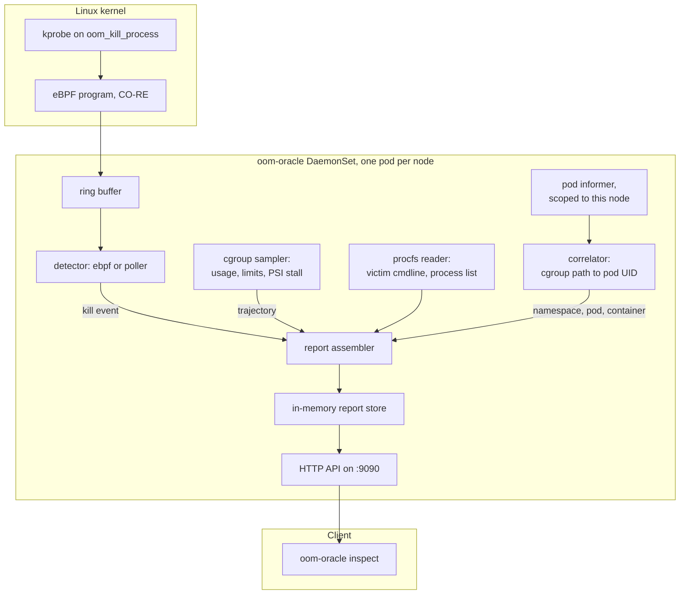

# OOM Oracle

A node agent that explains Kubernetes OOM kills at the level the control plane
cannot: which process died, how much memory it held at the moment the kernel
chose it, what the memory curve looked like on the way there, and what else was
in the container when it happened.


## The one thing Kubernetes cannot tell you

Kubernetes tells you `OOMKilled` and exit code 137, and then stops. It cannot
tell you which of the five processes in that container took the memory, what it
held at the moment the kernel picked it, or whether usage climbed for an hour or
spiked in a second.

On a pool of workers that all exec the same binary, "which one" is the entire
question, and the answer is on the node, in a kernel ring buffer you probably
cannot reach.

```
POD: payment-api-6d5f78 (namespace: default)
CONTAINER: web-server (image: payment:v1.2.0)
QOS: Burstable

DIAGNOSIS: OOMKilled (2026-08-13 08:15:22 UTC)
  Limit:        512.0MiB
  Peak usage:   512.0MiB
  Kill count:   1
  Detected by:  ebpf
  Growth rate:  1.0MiB/s (fit R²=0.97 over 1m0s)

MEMORY TRAJECTORY (last 1m0s):
  08:14:22:  412.0MiB / 512.0MiB  [██████████████░░░░]  80%
  08:14:37:  460.0MiB / 512.0MiB  [████████████████░░]  90%  (stall 12%)
  08:14:52:  498.0MiB / 512.0MiB  [█████████████████░]  97%  (stall 24%)
  08:15:07:  507.0MiB / 512.0MiB  [█████████████████░]  99%  (stall 36%)
  08:15:22:  512.0MiB / 512.0MiB  [██████████████████] 100%  (stall 48%)

VICTIM PROCESS:
  PID:             28145 (in container: 17)
  Command:         node ./dist/garbage-collector.js
  Exit code:       137 (OOM)
  Memory at death: 114.0MiB
  Confidence:      traced in the kernel at the moment of the kill.

PROCESSES IN CONTAINER AFTER THE KILL:
  memory.oom.group=0: the kernel killed only the process it
  selected, so these were still running after it died.
  1. node ./dist/server.js (PID 28102) - 390.0MiB
  2. node ./dist/worker.js (PID 28160) - 8.0MiB
```

`stall` is the cgroup's `memory.pressure` **full** ten-second average at that
sample: the share of time during which every task in the cgroup was stalled
waiting on memory reclaim. It climbing ahead of the limit is the signal that a
kill is coming.

## The harder case, which depends on your runtime

`memory.oom.group` decides whether the kernel kills one process or the whole
container. containerd sets it to 1, so the container dies and at least something
is reported. Docker and Moby leave it at 0, and there a forked child can be
killed while the container keeps running: the pod stays `Running`, the restart
count stays at zero, and Kubernetes reports nothing whatsoever.

[Diagnose a Multi-Process Container](guides/multi-process.md) demonstrates both
and shows how to tell which you are on.

## How it works

OOM Oracle attaches a kprobe to the kernel's `oom_kill_process`, samples cgroup
memory continuously so a trajectory already exists when the kill lands, and
resolves the cgroup path back to a namespace, pod and container name.



1. **Traces the kill in the kernel.** A kprobe on `oom_kill_process` reports the
   victim's PID, its PID namespace, its `comm`, and its resident memory read out
   of the victim's own `mm` as the kernel selects it. Near-zero overhead, and no
   dependence on the cgroup still existing afterwards.
2. **Keeps a trajectory, not a snapshot.** Cgroup v1 and v2 memory usage, limits
   and PSI stall are sampled continuously into a ring buffer per container, so a
   slow leak arrives with its climb already recorded. An allocation faster than
   the sample interval will not show a climb, and `peakBytes` is read from the
   kernel's `memory.peak` precisely so that case still has an honest number.
3. **Names the process, not just the container.** The victim's `comm` and its
   container-local `nsPid` come from the kernel. `/proc` is also read while the
   victim is dying to recover its full command line and its siblings, though
   that race is often lost and those fields can be absent.
4. **Resolves cluster identity.** A node-scoped pod informer turns the pod UID
   in a cgroup path into a namespace, pod, container and image.
5. **Renders a terminal post-mortem.** Plain text or JSON, over an HTTP API the
   `inspect` command reads.

## Where to go next

| | |
|---|---|
| [Getting Started](getting-started.md) | Install, deploy, trigger a kill, read the report |
| [Detectors](detectors.md) | eBPF versus polling, and why one is a fallback |
| [Configuration](configuration.md) | Every flag on every command |
| [API Reference](reference/api.md) | The routes and the report schema |
| [Troubleshooting](troubleshooting.md) | When the detector will not attach |

## Project status

Released and installable. `v0.1.1` publishes signed CLI archives, a multi-arch
image on `ghcr.io`, and a Helm chart listed on
[Artifact Hub](https://artifacthub.io/packages/helm/oom-oracle/oom-oracle).

Still pre-1.0, so the HTTP API and report JSON can change shape. Every break is
written up with the migration it needs in the
[changelog](changelog.md), because a commit subject cannot tell you which JSON
field to rename.

Working today: both detectors, cgroup v1 and v2 sampling, pod-name correlation,
the HTTP API, the text and JSON renderers, the `oom-oracle watch` dashboard, a
Helm chart, and an e2e suite that runs on kind in CI.

The project's [ROADMAP](https://github.com/ethan-kane-ops/k8s-pod-oom-oracle/blob/main/ROADMAP.md)
has the full picture, including the known limitations worth reading before you
deploy this on anything you care about.
